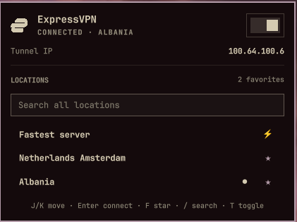

# ExpressVPN for Omarchy

A compact Omarchy Quattro bar widget for checking and toggling ExpressVPN.



- Left-click opens a status panel with an on/off switch.
- Right-click connects or disconnects immediately.
- Middle-click refreshes the status.
- The bar dot pulses while the connection is changing.
- Search all ExpressVPN locations in the panel and reconnect to one directly.
- Connect through ExpressVPN's Smart Location from the always-visible Fastest server row.
- Star frequently used locations to keep them at the top of the picker.
- See the active tunnel IP in the panel while connected.
- Press `/` to focus location search; navigation keys remain available outside it.

The plugin uses the installed `expressvpnctl` command and stores no account,
activation, or connection credentials.

## Requirements

- Omarchy Quattro
- The official ExpressVPN Linux application, activated and providing the
  `expressvpnctl` command

## Install

```sh
omarchy plugin add https://github.com/pjgeutjens/omarchy-expressvpn.git
omarchy plugin enable io.github.pjgeutjens.expressvpn
```

The widget defaults to the right section of the bar. Move it with:

```sh
omarchy bar move io.github.pjgeutjens.expressvpn --section right
```

## Branding

The widget resolves the `expressvpn` desktop icon installed by the official
ExpressVPN application. This repository does not redistribute ExpressVPN
artwork. ExpressVPN and its logo are trademarks of their respective owner;
this independent plugin is not affiliated with or endorsed by ExpressVPN.

## One-time ExpressVPN setup

The ExpressVPN GUI must be running, or background mode must be enabled, for a
bar plugin to connect while the GUI is closed:

```sh
expressvpnctl background enable
```

Disconnecting works regardless of whether background mode is enabled.

## Update

```sh
omarchy plugin update
```

## Remove

```sh
omarchy plugin remove io.github.pjgeutjens.expressvpn
```

## Local development

Validate the plugin from this repository:

```sh
./scripts/validate.sh
```

Install a local working copy:

```sh
plugin_id=io.github.pjgeutjens.expressvpn
plugin_dir="$HOME/.config/omarchy/plugins/$plugin_id"
mkdir -p "$plugin_dir"
rsync -a --delete \
  --exclude .git \
  --exclude .agents \
  --exclude .codex \
  ./ "$plugin_dir/"
omarchy-shell shell rescanPlugins
omarchy plugin enable "$plugin_id"
```

It can also be controlled through Omarchy Shell IPC:

```sh
vpn=io.github.pjgeutjens.expressvpn
omarchy-shell "$vpn" open
omarchy-shell "$vpn" connect
omarchy-shell "$vpn" connectTo belgium
omarchy-shell "$vpn" disconnect
omarchy-shell "$vpn" toggleVpn
omarchy-shell "$vpn" refresh
omarchy-shell "$vpn" status
```
